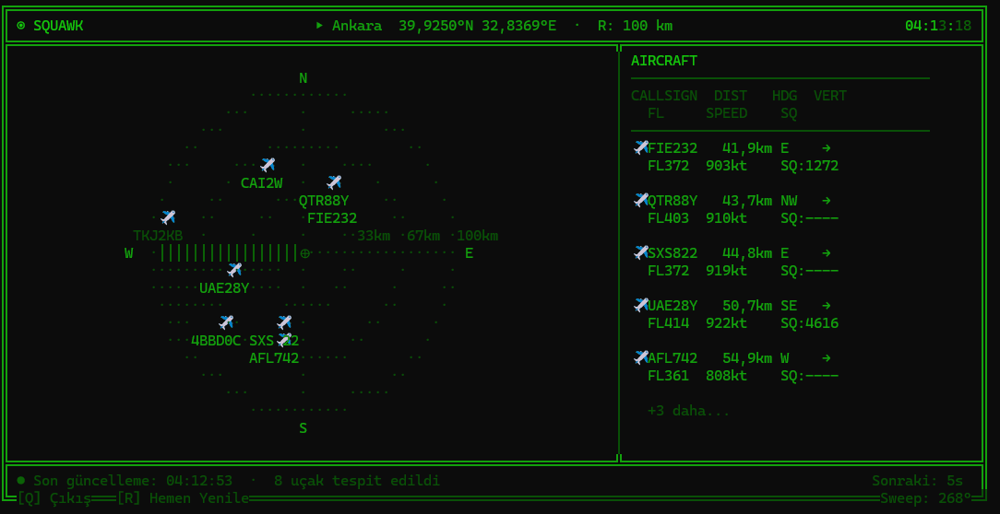

<div align="center">

🌐 **Dil / Language:** Türkçe &nbsp;|&nbsp; [English](README.md)

<br />



# squawk ✈

**Yakınındaki gerçek uçakları terminalde, gerçek zamanlı olarak gösteren bir ATC radarı.**

[](https://dotnet.microsoft.com/)
[](#gereksinimler)
[](https://opensky-network.org/)
[](LICENSE)

</div>

---

`squawk`, [OpenSky Network API](https://opensky-network.org/)'sinden her 30 saniyede bir canlı uçuş verisi çeker ve terminalinde yeşil fosfor radarı olarak gösterir — tıpkı hava trafik kontrolörlerinin kullandığı gibi.

---

## İçindekiler

- [**Hızlı Kurulum**](#hızlı-kurulum) ← buradan başla
- [Özellikler](#özellikler)
- [Gereksinimler](#gereksinimler)
- [İlk Çalıştırma — Kurulum Sihirbazı](#i̇lk-çalıştırma--kurulum-sihirbazı)
- [OpenSky Network API Kurulumu](#opensky-network-api-kurulumu)
- [Kullanım](#kullanım)
- [Ekranı Okumak](#ekranı-okumak)
  - [Radar (Sol Panel)](#radar-sol-panel)
  - [Uçak Listesi (Sağ Panel)](#uçak-listesi-sağ-panel)
  - [Pusula Yönleri](#pusula-yönleri)
  - [Özel Squawk Kodları](#özel-squawk-kodları)
  - [Durum Çubuğu](#durum-çubuğu)
- [Klavye Kısayolları](#klavye-kısayolları)
- [Ayarları Değiştirmek](#ayarları-değiştirmek)
- [Tek Dosya Binary Oluşturmak](#tek-dosya-binary-oluşturmak)
- [NuGet'e Yayınlamak](#nugete-yayınlamak)
- [Güvenlik](#güvenlik)
- [Nasıl Çalışır](#nasıl-çalışır)
- [Lisans](#lisans)

---

## Özellikler

- 🟢 **Yeşil fosfor radar** — dönen tarama çizgisi, eşmerkezli mesafe halkaları, pusula etiketleri
- ✈ **Canlı uçaklar** — [OpenSky Network](https://opensky-network.org/) verisiyle, her 30 saniyede bir güncellenir
- 📡 **Ayarlanabilir yarıçap** — varsayılan 20 km, `--radius` ile çalışma başına değiştirilebilir
- 🔢 **Zengin uçak verisi** — uçuş seviyesi, hız, yön, transponder (squawk) kodu
- 🚨 **Acil squawk vurgulama** — 7700/7500/7600 kodları otomatik olarak sarıya döner
- 💾 **Güvenli kimlik bilgileri** — API anahtarları ve konumun proje dışında OS kullanıcı klasöründe saklanır
- 🖥️ **Çapraz platform** — Windows Terminal, PowerShell 7+, macOS Terminal

---

## Gereksinimler

| Gereksinim | Detay |
|---|---|
| **.NET 10 SDK** | [Buradan indir](https://dotnet.microsoft.com/download/dotnet/10.0) |
| **Terminal** | Windows Terminal veya PowerShell 7+ (Windows) · Terminal.app veya iTerm2 (macOS) |
| **OpenSky Hesabı** | [opensky-network.org](https://opensky-network.org/)'da ücretsiz — anonim erişim de çalışır |

> **Neden CMD değil?**  
> Klasik `cmd.exe`, bu uygulamanın kullandığı Unicode karakterleri (✈, ─, ╔ vb.) ve ANSI renk kodlarını düzgün desteklemez. Windows Terminal veya PowerShell 7+ ile sorunsuz çalışır.

---

## Hızlı Kurulum

> **[.NET 10 SDK veya Runtime](https://dotnet.microsoft.com/download/dotnet/10.0) gereklidir** — tek ön koşul bu.

squawk'ı tek komutla global .NET aracı olarak kur:

```bash
dotnet tool install -g squawk
```

Ardından **terminalin herhangi bir yerinde** çalıştır:

```bash
squawk
```

İlk açılışta [Kurulum Sihirbazı](#i̇lk-çalıştırma--kurulum-sihirbazı) konum ve API bilgilerini sorar.

### Güncelleme

```bash
dotnet tool update -g squawk
```

### Kaldırma

```bash
dotnet tool uninstall -g squawk
```

---

## Kaynak Koddan Kurulum

Katkıda bulunmak veya kodu incelemek isteyenler için:

**1. Klonla**

```bash
git clone https://github.com/KULLANICI_ADIN/squawk.git
cd squawk/src/Squawk
```

**2. Çalıştır**

```bash
dotnet run
```

Docker yok, npm yok, Python yok — sadece .NET.

---

## İlk Çalıştırma — Kurulum Sihirbazı

`squawk`'ı ilk çalıştırdığında interaktif bir sihirbaz otomatik olarak başlar:

```bash
dotnet run
```

```
  ╔══════════════════════════════════════════╗
  ║         ◉  SQUAWK — İlk Kurulum         ║
  ╚══════════════════════════════════════════╝

  📍 Konum
  ▸ Konum adı (örn. Istanbul): Ankara
  ▸ Enlem (Latitude, örn. 39.9250):  39.9250
  ▸ Boylam (Longitude, örn. 32.8369): 32.8369

  📡 Radar
  ▸ Yarıçap (km) [20]: 20

  🔑 OpenSky Network API
  ▸ Client ID: CLIENT_ID'İN
  ▸ Client Secret: CLIENT_SECRET'İN

  ✓ Ayarlar kaydedildi.
```

Cevapların **proje dışında** bir config dosyasına kaydedilir:

| İşletim Sistemi | Config dosyası konumu |
|---|---|
| Windows | `%APPDATA%\squawk\config.json` |
| macOS | `~/.config/squawk/config.json` |
| Linux | `~/.config/squawk/config.json` |

Bu sayede kimlik bilgilerin ve konumun **Git'e asla commit edilmez**.

---

## OpenSky Network API Kurulumu

OpenSky iki erişim seviyesi sunar:

### Seçenek A — Anonim (en kolay)

Kurulum sırasında Client ID ve Client Secret alanlarını boş bırak. Anonim erişim çalışır, ancak günlük istek kotası daha düşüktür. 30 saniyelik yenileme aralığıyla kişisel kullanım için genellikle yeterlidir.

### Seçenek B — Kimlik doğrulamalı (önerilen)

Kimlik doğrulamalı erişim daha yüksek rate limit sağlar ve ücretsizdir.

1. [opensky-network.org](https://opensky-network.org/)'da ücretsiz hesap oluştur
2. Giriş yap → **Account** → **API Clients** → **Create new client**
3. `client_id` ve `client_secret` alırsın
4. Sihirbaz sorduğunda gir veya `dotnet run -- --setup` ile yeniden yapılandır

> **Not:** Mart 2026 itibarıyla OpenSky, kullanıcı adı/şifre yerine **OAuth2 client credentials** kullanıyor. squawk token alımını ve otomatik yenilemeyi senin adına halleder.

---

## Kullanım

```bash
# Varsayılan — sihirbazda yapılandırdığın ayarlarla çalış
dotnet run

# Sadece bu oturum için yarıçapı değiştir (kayıtlı config'i değiştirmez)
dotnet run -- --radius 50

# Sadece bu oturum için konumu değiştir
dotnet run -- --lat 39.9250 --lon 32.8369

# Seçenekleri birleştir
dotnet run -- --lat 39.9250 --lon 32.8369 --radius 30

# Kurulum sihirbazını yeniden çalıştır (konum, yarıçap veya API anahtarı değiştirmek için)
dotnet run -- --setup

# Yardım
dotnet run -- --help
```

### Tüm CLI seçenekleri

| Seçenek | Tür | Açıklama |
|---|---|---|
| `--radius <km>` | `float` | Radar yarıçapı km cinsinden (varsayılan: config'deki değer, yoksa 20) |
| `--lat <derece>` | `float` | Enleminiz (bu oturum için config'i override eder) |
| `--lon <derece>` | `float` | Boylamınız (bu oturum için config'i override eder) |
| `--setup` | bayrak | İnteraktif kurulum sihirbazını yeniden çalıştır |
| `--help` | bayrak | Yardımı göster |

---

## Ekranı Okumak

### Radar (Sol Panel)

```
              N
         . . · . . .
      ·               ·
    ·    ✈              ·
   ·   THY448            ·
  W·---------⊕---------·E
   ·         ✈          ·
    ·      PGT891  20km·
      ·               ·
         . . · . . .
              S
```

| Öğe | Anlamı |
|---|---|
| `⊕` | **Senin konumun** — radarın tam merkezi |
| `N / S / E / W` | **Pusula etiketleri** — Kuzey, Güney, Doğu, Batı |
| `. . · . .` | **Mesafe halkaları** — yarıçapın 1/3, 2/3 ve tamamında üç eşmerkezli daire |
| `20km` | **Mesafe etiketi** — en dıştaki halkanın mesafesi (yapılandırdığın yarıçap) |
| `✈` | **Uçak** — senden gerçek açı ve mesafesine göre radar üzerinde konumlandırılır |
| `✈` altındaki callsign | **Uçuş kimliği** — uçağın callsign'ı (örn. `THY448`). Callsign yayınlanmıyorsa ICAO adresi gösterilir |
| Dönen parlak çizgi | **Tarama çizgisi** — 30 saniyede tam tur tamamlar, API yenilemesiyle senkron |
| Tarama gerisindeki soluk iz | **Kalıcılık efekti** — gerçek radar ekranlarındaki fosfor parıltısının solmasını taklit eder |

**Uçağın nerede olduğunu nasıl okursun:**  
Radar yukarıdan bir harita gibidir. `✈` dairenin sağ üst bölümünde görünüyorsa o uçak **kuzeydoğunda**. Kenara yakınsa belirlediğin menzile yakın, merkeze yakınsa sana yakın demektir.

---

### Uçak Listesi (Sağ Panel)

Her uçak **iki satır** olarak gösterilir:

```
✈ THY448   8.2km  E    ↑
  FL280    480kt  SQ:2341
```

#### 1. Satır

| Alan | Örnek | Anlamı |
|---|---|---|
| `✈` | `✈` | Uçak göstergesi |
| Callsign | `THY448` | Uçuşun telsiz çağrı kodu. Havayolları kendi kodlarını kullanır: `THY` (Türk Hava Yolları), `PGT` (Pegasus), `SXS` (SunExpress), `TOM` (TUI) gibi. Callsign yayınlanmıyorsa ICAO hex adresi görünür. |
| Mesafe | `8.2km` | Senin konumundan uçağa olan düz çizgi mesafe. Haversine formülüyle hesaplanır. |
| Yön (HDG) | `E` | **Uçağın gittiği yön** — senden uçağa olan yön değil. Bkz. [Pusula Yönleri](#pusula-yönleri). |
| Dikey | `↑` `↓` `→` | Uçak **tırmanıyor** mu (↑), **alçalıyor** mu (↓), yoksa **düz uçuyor** mu (→) |

#### 2. Satır

| Alan | Örnek | Anlamı |
|---|---|---|
| Uçuş Seviyesi | `FL280` | **Flight Level** olarak irtifa. FL280, yaklaşık 28.000 feet (yaklaşık 8.534 metre) demektir. FL değerini 10'a bölerek km olarak kabaca tahmin edebilirsin: FL280 ≈ 8,5 km yükseklik. |
| Hız | `480kt` | Yer hızı **knot** (kt) cinsinden. 1 knot = 1,852 km/s. Ticari uçakların tipik seyir hızı 450–500 kt'dir. |
| Squawk | `SQ:2341` | Pilotun ayarladığı **transponder kodu**. Hava trafik kontrolünün uçağı radarda tanımlamak için atadığı 4 haneli bir kod. Bkz. [Özel Squawk Kodları](#özel-squawk-kodları). |

---

### Pusula Yönleri

**HDG** (Heading) sütunu, uçağın hangi yöne gittiğini 8 pusula noktasıyla gösterir:

| Kod | Tam adı | Anlamı |
|---|---|---|
| `N` | Kuzey | Kuzeye doğru uçuyor (yaklaşık 0° / 360°) |
| `NE` | Kuzeydoğu | Kuzeydoğuya doğru uçuyor (~45°) |
| `E` | Doğu | Doğuya doğru uçuyor (~90°) |
| `SE` | Güneydoğu | Güneydoğuya doğru uçuyor (~135°) |
| `S` | Güney | Güneye doğru uçuyor (~180°) |
| `SW` | Güneybatı | Güneybatıya doğru uçuyor (~225°) |
| `W` | Batı | Batıya doğru uçuyor (~270°) |
| `NW` | Kuzeybatı | Kuzeybatıya doğru uçuyor (~315°) |
| `--` | Bilinmiyor | Uçak yön verisi yayınlamıyor |

**Örnek:** HDG sütununda `SW` yazan bir uçuş Güneybatı Avrupa'ya veya Akdeniz'e doğru gidiyor demektir. `NE` yazan bir uçuş Rusya'ya veya Orta Asya'ya yöneliyor olabilir.

> **Heading ile radar pozisyonu arasındaki fark:**  
> `HDG` uçağın **nereye gittiğini** söyler.  
> Radar dairesinde `✈` ikonunun durduğu yer, uçağın **sana göre nerede olduğunu** söyler.  
> Bunlar iki farklı bilgidir — bir uçak kuzeyde olabilir ama güneye doğru uçuyor olabilir (geçti ve uzaklaşıyor).

---

### Özel Squawk Kodları

Bu kodlar uluslararası standart acil transponder kodlarıdır. squawk bunlardan birini tespit ettiğinde ilgili uçak satırını **sarıyla** vurgular:

| Kod | Gösterim | Anlamı |
|---|---|---|
| `7700` | `SQ:7700⚠` | **Genel acil durum** — uçak acil durum ilan etti (motor arızası, tıbbi durum, yakıt, vb.) |
| `7600` | `SQ:7600📻` | **Radyo arızası** — uçak ATC ile iletişimi kaybetti |
| `7500` | `SQ:7500🚨` | **Kaçırılma** — uçak kaçırılıyor |

Diğer tüm kodlar (örn. `SQ:2341`) normal ATC tarafından atanmış kodlardır, halka açık özel bir anlamları yoktur.

---

### Durum Çubuğu

```
  ● Son güncelleme: 03:12:35  ·  2 uçak            Sonraki: 18s
```

| Öğe | Anlamı |
|---|---|
| `●` | Yeşil = veri başarıyla yüklendi |
| `◌` | Yanıp sönen = şu an API'dan veri alınıyor |
| `⚠` | Sarı = son API isteği başarısız oldu |
| `Son güncelleme: SS:DD:SS` | Son başarılı veri yenilemesinin saati |
| `N uçak` | Şu an yarıçap içinde tespit edilen uçak sayısı |
| `Sonraki: Ns` | Bir sonraki API isteğine kalan saniye |

---

## Klavye Kısayolları

| Tuş | Eylem |
|---|---|
| `R` | Anında API yenilemesi yap (30 saniyelik zamanlayıcıyı bekleme) |
| `Q` veya `Esc` | squawk'tan çık |
| `Ctrl+C` | Düzgün kapatma |

---

## Ayarları Değiştirmek

Konum mu değişti? Yeni OpenSky kimlik bilgileri mi var? Kurulum sihirbazını yeniden çalıştır:

```bash
dotnet run -- --setup
```

Ya da config dosyasını doğrudan düzenle:

**Windows:** `%APPDATA%\squawk\config.json`  
**macOS/Linux:** `~/.config/squawk/config.json`

```json
{
  "OpenSky": {
    "ClientId": "client-id'in",
    "ClientSecret": "client-secret'in",
    "TokenUrl": "https://auth.opensky-network.org/auth/realms/opensky-network/protocol/openid-connect/token"
  },
  "Location": {
    "Latitude": 39.9250,
    "Longitude": 32.8369,
    "Name": "Ankara"
  },
  "Radar": {
    "RadiusKm": 20,
    "RefreshSeconds": 30
  }
}
```

> **İpucu:** Dosyaya dokunmadan herhangi bir ayarı override etmek için `SQUAWK_` ön ekiyle ortam değişkeni de kullanabilirsin. Örneğin: `SQUAWK_Radar__RadiusKm=50 dotnet run`

---

## Tek Dosya Binary Oluşturmak

`dotnet run` gerektirmeden her yerden çalıştırılabilen bağımsız bir `squawk` dosyası için:

**Windows (x64):**
```powershell
dotnet publish -c Release -r win-x64 --self-contained -p:PublishSingleFile=true -o out/win
# Sonuç: out/win/squawk.exe
```

**macOS (Apple Silicon):**
```bash
dotnet publish -c Release -r osx-arm64 --self-contained -p:PublishSingleFile=true -o out/mac
# Sonuç: out/mac/squawk
```

**macOS (Intel):**
```bash
dotnet publish -c Release -r osx-x64 --self-contained -p:PublishSingleFile=true -o out/mac-intel
```

**Linux (x64):**
```bash
dotnet publish -c Release -r linux-x64 --self-contained -p:PublishSingleFile=true -o out/linux
```

Publish sonrası binary'yi `PATH`'e ekle ve her yerden sadece `squawk` yazarak çalıştır.

---

## NuGet'e Yayınlamak

Bu adımları izleyerek herkesin `dotnet tool install -g squawk` ile kurmasını sağlayabilirsin.

### Bir kez yapılacaklar

**1. NuGet hesabı oluştur**

[nuget.org](https://www.nuget.org/) → GitHub veya Microsoft hesabınla giriş yap → **API Keys** → **Create** → adı `squawk-publish` yap, **Glob pattern** olarak `squawk` gir, anahtarı kopyala.

**2. Anahtarı GitHub repo'na ekle**

GitHub repo → **Settings** → **Secrets and variables** → **Actions** → **New repository secret**  
Ad: `NUGET_API_KEY`, Değer: kopyaladığın anahtar.

**3. `Squawk.csproj` içindeki yer tutucuları doldur**

`YOUR_NAME` ve `YOUR_GITHUB_USERNAME` değerlerini gerçek bilgilerinle değiştir — `Squawk.csproj` içinde zaten `Cankat ABACI` ve `cankatabaci` olarak doldurulmuşsa bu adımı atlayabilirsin.

> **Paket adını kontrol et!** Yayınlamadan önce [nuget.org/packages/squawk](https://www.nuget.org/packages/squawk) adresinde `squawk` adının alınıp alınmadığını kontrol et. Alınmışsa `<PackageId>`'yi `squawk-radar` veya `squawk-atc` gibi benzersiz bir isme değiştir. `<ToolCommandName>squawk</ToolCommandName>` olduğu gibi kalabilir — bu kullanıcının terminale yazdığı komuttur.

### Yayınlama (GitHub Actions ile otomatik)

```bash
# 1. Değişiklikleri commit et
git add .
git commit -m "feat: ilk sürüm"

# 2. Sürüm etiketi oluştur — workflow otomatik tetiklenir
git tag v1.0.0
git push origin main --tags
```

Hepsi bu kadar. [GitHub Actions workflow](.github/workflows/release.yml) otomatik olarak:
1. `1.0.0` sürümlü NuGet paketini oluşturur
2. nuget.org'a yükler
3. GitHub Release oluşturur

### Yayınlama (manuel)

```bash
dotnet pack src/Squawk/Squawk.csproj -c Release -p:Version=1.0.0 -o nupkg

dotnet nuget push nupkg/squawk.1.0.0.nupkg \
  --api-key NUGET_API_ANAHTARIN \
  --source https://api.nuget.org/v3/index.json
```

### Yeni sürüm çıkarmak

```bash
# Squawk.csproj'daki <Version>'ı 1.0.1 yap, sonra:
git add .
git commit -m "fix: bir şeyi düzelttim"
git tag v1.0.1
git push origin main --tags
```

---

## Güvenlik

| Ne | Nerede saklanır | Repo'da var mı? |
|---|---|---|
| OpenSky Client ID ve Secret | `%APPDATA%\squawk\config.json` | ❌ Hayır |
| Enlem ve boylam bilgin | `%APPDATA%\squawk\config.json` | ❌ Hayır |
| Varsayılan config şablonu | `src/Squawk/appsettings.json` | ✅ Evet — tüm değerler boş string |
| Kaynak kodlar | `src/Squawk/` | ✅ Evet — hiçbir yerde gizli bilgi yok |

Kaynak kodla gelen `appsettings.json` yalnızca boş yer tutucular içerir. Gerçek kimlik bilgilerin OS kullanıcı klasörüne kaydedilir ve `.gitignore`'da listelidir.

---

## Nasıl Çalışır

```
┌─────────────────────────────────────────────────────────┐
│                    Her 30 saniyede bir                   │
│  1. Konumun etrafında bounding box hesapla              │
│  2. GET /api/states/all?lamin=...&lomin=...             │
│     Bearer token ile (OAuth2 client_credentials)        │
│  3. JSON state vector'larını parse et                   │
│  4. Her uçak için Haversine mesafesi hesapla            │
│  5. Yarıçapa göre filtrele, mesafeye göre sırala        │
└─────────────────────────────────────────────────────────┘
                           │
                           ▼
┌─────────────────────────────────────────────────────────┐
│                    Her ~80ms'de bir (~12 FPS)            │
│  1. Tarama açısını 1.2° ilerlet                         │
│     (360° / 30s = 12°/s = 1.2° / 80ms frame)           │
│  2. Ekran dışı karakter tampona çiz (temizle → halkalar │
│     → crosshair → tarama izi → tarama çizgisi → uçaklar)│
│  3. Diff render: sadece değişen terminal hücrelerini    │
│     yaz → titreme yok, minimum I/O                      │
└─────────────────────────────────────────────────────────┘
```

**Temel tasarım kararları:**

- **Harici UI kütüphanesi yok** — tam kontrol ve minimum bağımlılık için ham ANSI escape kodları
- **Diff rendering** — canvas her frame için mevcut ve önceki frame'i karşılaştırır; yalnızca değişen karakterler terminale yazılır, titreme olmaz
- **Aspect ratio düzeltmesi** — terminal karakter hücreleri yaklaşık 2× daha yüksektir, bu nedenle dikey radar yarıçapı yatay yarıçapın yarısına ayarlanır → görsel olarak dairesel bir ekran elde edilir
- **Bearing → ekran pozisyonu** — uçaklar `sin(bearing)` X koordinatı, `-cos(bearing)` Y koordinatı kullanılarak yerleştirilir; bu, coğrafi açıları (0° = Kuzey, saat yönünde) ekran koordinatlarına (Y aşağı artar) doğru şekilde dönüştürür

---

## Lisans

MIT — istediğin gibi kullan.

---

<div align="center">
☕ ve tepemde uçan uçakları izleme merakıyla yapıldı.
</div>
